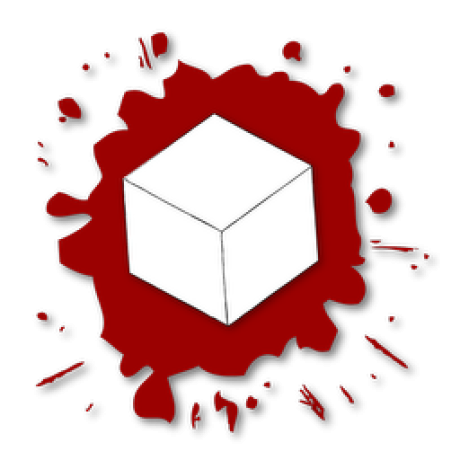

<a id="readme-top"></a>

<br />
<div align="center">
  <a href="https://assault.cubers.net/">
    
  </a>

<h3 align="center">AssaultCube DMA Cheat</h3>

  <p align="center">
    AssaultCubeDMA is a proof-of-concept external cheat for AssaultCube using DMA (Direct Memory Access) techniques. It demonstrates reading and manipulating game memory externally, featuring ESP and other basic functionalities. Intended for educational and research purposes only.
    <br />
    <br />
    <a href="https://www.youtube.com/watch?v=T_itQoNx3rk&ab_channel=kaveOO" target="_blank">View Demo on YouTube</a>
  </p>
</div>

<!-- ABOUT THE PROJECT -->
## About The Project

![AssaultCubeDMA][product-screenshot]

<p align="right">(<a href="#readme-top">back to top</a>)</p>


### Built With

* [![C++][C++]][C++-url]
* [![VisualStudio][VisualStudio]][VisualStudio-url]
* [![IdaPro][IdaPro]][IdaPro-url]


<p align="right">(<a href="#readme-top">back to top</a>)</p>

<!-- GETTING STARTED -->
## Getting Started

<br>

> [!WARNING]  
> This project requires a Direct Memory Access (DMA) card to operate.

<br>

### No Compilation Needed

1. Download from Releases
   ```sh
   Download CompiledCheat.zip from the Releases tab of the Repository
   ```
2. Extract the .zip
   ```sh
   Extract the CompiledCheat.zip archive
   ```
3. Enjoy !
   ```
   Start AssaultCube and run AssaultCubeDMA.exe
   ```

### Installation & Compilation

1. Clone the repo
   ```sh
   git clone https://github.com/1337Corporation/AssaultCubeDMA.git
   ```
2. Build DMALibrary (Release)
   ```sh
   Open DMALibrary.sln change the configuration to Release and build it
   ```
3. Build AssaultCubeDMA (Debug)
   ```sh
   Open AssaultCubeDMA.sln keep the Debug config and build it.
   ```
4. Add MemProcFS binaries
   ```sh
   Download MemProcFS binaries from Releases tab of the Repo
   ```
5. Navigate to x64/Debug directory
   ```sh
   cd AssaultCubeDMA\AssaultCubeDMA\x64\Debug
   ```
6. Extract all binaries
   ```sh
   Extract all binaries at the root of directory (not inside a MemProcFS directory)
   ```
7. Enjoy !
   ```sh
   Start AssaultCube and run AssaultCubeDMA.exe
   ```

<p align="right">(<a href="#readme-top">back to top</a>)</p>

<!-- LICENSE -->
## License

Distributed under the MIT License. See `LICENSE.txt` for more information.

<p align="right">(<a href="#readme-top">back to top</a>)</p>

<!-- ACKNOWLEDGMENTS -->
## Acknowledgments

* [DMALibrary](https://github.com/Metick/DMALibrary)
* [MemProcFS (this guy is too good...)](https://github.com/ufrisk/MemProcFS)
* [UnknownCheats](https://www.unknowncheats.me/forum/index.php)
* [IDA CheatSheet](https://malwareunicorn.org/workshops/idacheatsheet.html)
* [Brain (mine)](https://en.wikipedia.org/wiki/Brain)
* [ImGui (UI & Rendering)](https://github.com/ocornut/imgui)
<p align="right">(<a href="#readme-top">back to top</a>)</p>


<!-- MARKDOWN LINKS & IMAGES -->
<!-- https://www.markdownguide.org/basic-syntax/#reference-style-links -->
[contributors-shield]: https://img.shields.io/github/contributors/1337Corporation/AssaultCubeDMA.svg?style=for-the-badge
[contributors-url]: https://github.com/1337Corporation/AssaultCubeDMA/graphs/contributors
[forks-shield]: https://img.shields.io/github/forks/1337Corporation/AssaultCubeDMA.svg?style=for-the-badge
[forks-url]: https://github.com/1337Corporation/AssaultCubeDMA/network/members
[stars-shield]: https://img.shields.io/github/stars/1337Corporation/AssaultCubeDMA.svg?style=for-the-badge
[stars-url]: https://github.com/1337Corporation/AssaultCubeDMA/stargazers
[issues-shield]: https://img.shields.io/github/issues/1337Corporation/AssaultCubeDMA.svg?style=for-the-badge
[issues-url]: https://github.com/1337Corporation/AssaultCubeDMA/issues
[license-shield]: https://img.shields.io/github/license/1337Corporation/AssaultCubeDMA.svg?style=for-the-badge
[license-url]: https://github.com/1337Corporation/AssaultCubeDMA/blob/master/LICENSE.txt
[linkedin-shield]: https://img.shields.io/badge/linkedin-%230077B5.svg?style=for-the-badge&logo=linkedin&logoColor=white
[linkedin-url]: https://linkedin.com/in/alban-billiette-58a17b271
[product-screenshot]: Images/AssaultCubeCheat.png
[C++]: https://img.shields.io/badge/c++-%2300599C.svg?style=for-the-badge&logo=c%2B%2B&logoColor=white
[C++-url]: https://en.wikipedia.org/wiki/C%2B%2B
[VisualStudio]: https://img.shields.io/badge/Visual%20Studio-5C2D91.svg?style=for-the-badge&logo=visual-studio&logoColor=white
[VisualStudio-url]: https://visualstudio.microsoft.com/
[IdaPro]: https://hex-rays.com/hs-fs/hubfs/Imported_Blog_Media/ida4_banner-3.png?width=100&height=129&name=ida4_banner-3.png
[IdaPro-url]: https://hex-rays.com/ida-pro
